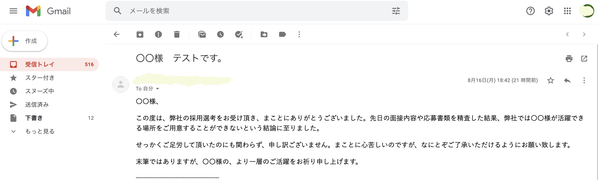
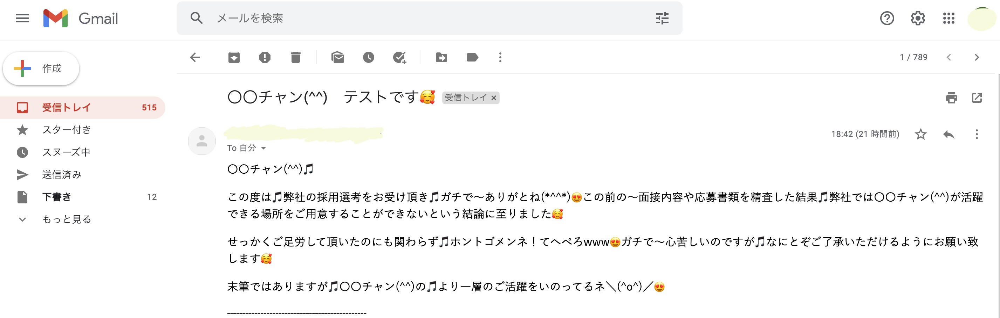

# Text-milder

就職活動時にかならず来るであろう「お祈りメール」に対しての対策として、メール分を柔らかくしメンタルブレイクを防止するような僕の僕による僕のための「Chromeの拡張機能」を作成いたしました。

-----------------------------------------------------------------------------------------------------------------------

使用言語
-----------------------------------------------------------------------------------------------------------------------

.JavaScript

------------------------------------------------------------------------------------------------------------------------

使用技術
------------------------------------------------------------------------------------------------------------------------
JavaScriptでChromeのHTML要素を取得して書き換えるという処理を書きました。

まず、requestIdleCallback関数を使い優先度の低い処理でもメインで実行させ、すべての処理を同時に行っているように見せています。
そして、document.body.innerHTML = document.body.innerHTML.replaceAll('')で実際のHTML要素をJavaScriptで取得し、書き換えています。

拡張前の画像↓

拡張後の画像　↓

エピソード
--------------------------------------------------------------------------------------------------------------------------

とある日、私は、ある先輩とこんな会話をしました。

私：「先輩、就活どうっすか？来年ニートすか？」
先輩A：「今んとこやばいわ。お祈りメールで鬱になりそう。」

え、就活ってそんなにやばいの？って思った。
確かに、進路を決めるときってだいたい病みそうになる。大学受験の時なんかは山のような不合格通知にガチ病みし、数週間日の光すら浴びなかったなー…特にあの「残念ながら…」が非常にむかつくのですよね。

ってことで事前になにかその対策をすることはできないのかと思い、「そうだ！向こう側のメールを全部改ざんすれば良い話ではないのか？」という結論に至ったのである。

例えば、友人を遊びに誘い断られた時
私：「8/20日遊びに行かね？」
友人：「すまん、バイト入っとるわ」

全くメンタルに来ないでしょ？
そうなんです。こんなノリで企業からのお祈りメールを書き換えるchromeの拡張機能を作ってしまえばいいのだ！

就活とは、メンタル勝負だ！全国の我以外の大学生諸君！自分のメンタルはChromeで守れ！

-----------------------------------------------------------------------------------------------------------------------

